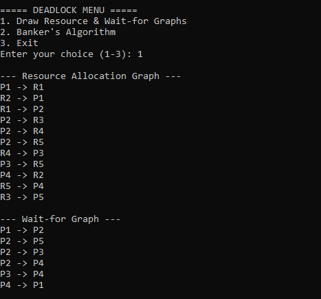
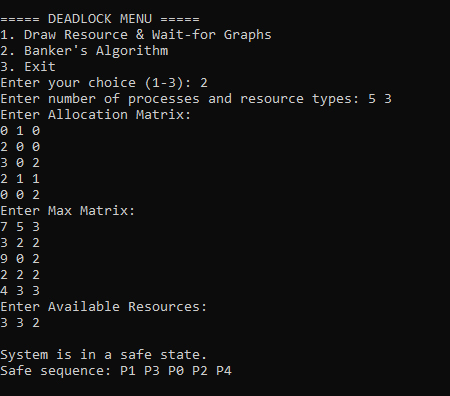

# Deadlock Management System (C++)

A comprehensive systems-programming tool that simulates how Operating Systems manage and resolve deadlocks. This project implements two fundamental strategies: **Deadlock Avoidance** (preventing deadlocks before they happen) and **Deadlock Detection** (identifying active deadlocks through graph analysis).

---

## Core Modules

### 1. Deadlock Avoidance (Banker's Algorithm)
Implements the **Banker’s Algorithm** to model resource allocation for multiple processes. It dynamically calculates the **Need Matrix** and determines if the system is in a **Safe State**, providing a valid execution sequence to ensure system stability.

### 2. Deadlock Detection (RAG & WFG)
Simulates resource dependencies using:
* **Resource Allocation Graph (RAG):** Maps relationships between processes and resource instances.
* **Wait-For Graph (WFG):** Automatically condenses the RAG into a simplified graph to detect circular waits (cycles), which are the primary indicators of a deadlock.

---

## Sample Output

The following screenshots demonstrate the CLI tool in action:

### I. Graph Detection (RAG & WFG)
Output showing the mapping of resource allocations and the derived Wait-For relationships.

### II. Banker's Algorithm (Safe State)
Calculation of a safe execution sequence based on Allocation, Max, and Available matrices.

---

## Installation

git clone [https://github.com/MariamAshraf25/deadlock-management-system.git](https://github.com/MariamAshraf25/deadlock-management-system.git)

---

## Author
**Mariam Ashraf** | Computer Engineering Student - Faculty of Engineering - Capital University (Formerly Helwan)
[LinkedIn Profile](https://www.linkedin.com/in/mariam-ashraf-84415b2b8)
